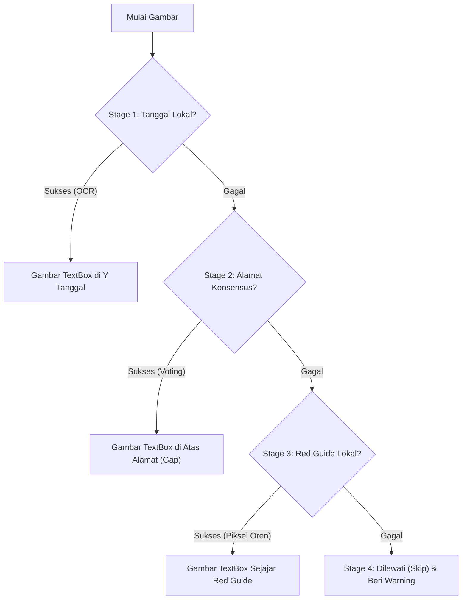

# Project OCR Foto Timemark

Project ini dibuat untuk membantu koreksi tanggal watermark Timemark pada foto dokumentasi kerja.

## Tujuan Project

- Mengganti teks tanggal yang salah pada watermark Timemark.
- Memproses banyak foto secara batch tanpa menimpa file asli.
- Mengekspor foto dokumentasi dari PDF dan mengelompokkannya berdasarkan aset.
- Menjadwalkan pengerjaan aset secara otomatis ke beberapa Tim kerja dengan rentang waktu dinamis.
- Menyediakan dashboard Web UI lokal untuk mengendalikan pipeline secara real-time.
- Menjaga hasil revisi tetap rapi dan mudah dicek ulang.
- Menyiapkan alur lanjutan untuk foto yang tertanam di file PDF.
- Menyimpan jejak perubahan melalui output baru dan log proses.

## Batasan Utama

- Area yang diedit hanya baris tanggal watermark.
- Export foto PDF harus mengambil foto dokumentasi, bukan halaman penuh.
- Pencarian kelompok aset pada PDF dimulai dari halaman 2 sampai halaman terakhir agar halaman daftar aset tidak ikut terbaca.
- Foto asli harus tetap disimpan.
- Output revisi harus memakai folder atau nama file berbeda.
- Untuk kebutuhan administrasi resmi, perubahan tanggal harus mengikuti instruksi yang valid dan dapat dilacak.

## Output PDF Foto

Foto dari PDF akan dikelompokkan berdasarkan judul aset di folder `03_photos_export/`, misalnya:

```text
03_photos_export/
  WESEL/
    W23A BOO/
      0.jpg
      50.jpg
      100.jpg
```

## Output Edit Foto

Saat edit tanggal foto dengan mode schedule, hasil edit dikelompokkan ke subfolder Tim di `04_photos_edited/`:

```text
04_photos_edited/
  Tim_1/
    WESEL/
      W23A BOO/
        0.jpg
        50.jpg
        100.jpg
```

Struktur subfolder tipe aset (`WESEL`/`AXC`/`SINYAL`) dan nama detail aset dipertahankan.

## Panduan Dokumentasi

Gunakan format ini supaya pengerjaan tetap konsisten di device lain.

### `README.md`

- Berisi tujuan project, batasan utama, output yang diharapkan, dan aturan dokumentasi.
- Jangan dipakai untuk catatan progres harian.
- Perbarui jika tujuan, batasan, atau format output project berubah.

### `setup.md`

- Berisi tahap kerja, struktur folder, perintah, tools, dependensi, dan alur menjalankan script.
- Perbarui jika ada script baru, command berubah, dependensi berubah, atau struktur folder berubah.
- Tulis instruksi yang bisa langsung diikuti di device baru.

### `Dashboard.md`

- Halaman indeks utama di Obsidian yang menghubungkan catatan status kerja (checklist, status skrip, dll).
- Halaman patokan utama untuk AI Assistant sebelum bekerja.

### `Notes/Daily/`

- Berisi log harian detail perkembangan project yang diperbarui setiap kali ada pengerjaan atau keputusan baru (menggantikan `memory.md`).

---

## 🛠️ Panduan Prioritas Deteksi Posisi (Stage Guide)

Untuk menempatkan textbox tanggal baru secara presisi tanpa menabrak alamat di bawahnya, script `edit_timemark_ide1.py` menggunakan **4-Stage Priority Flow** sebagai berikut:



### 📋 Detail dan Skenario Penggunaan:

1. **Stage 1: Tanggal Lokal (OCR Mandiri per Gambar) [Prioritas Utama]**
   * **Cara Kerja:** Melakukan OCR mandiri khusus pojok kiri bawah pada file tersebut untuk mencari teks tanggal lama (tahun `2025`/`2026`, bulan, `AM`/`PM`/`WIB`).
   * **Kelebihan:** Sangat presisi untuk file yang posisinya melompat secara fisik secara individual (misal `L60 0.jpg` di Y=203, sedangkan file lainnya di Y=188).

2. **Stage 2: Alamat Konsensus (Voting Alamat Tingkat Folder) [Fallback Kedua]**
   * **Cara Kerja:** Jika tanggal lokal gagal dibaca, program mencontek letak baris pertama teks alamat yang konsisten disepakati oleh mayoritas ($\ge 2$) file lain sefolder pada fase pre-scan. TextBox baru ditaruh menempel tepat di atas alamat tersebut dengan gap aman.
   * **Kelebihan:** Menghindari tabrakan dengan teks alamat jika tanggal lama terlalu buram/gelap untuk dideteksi secara mandiri.

3. **Stage 3: Red Guide Lokal (Deteksi Piksel Oren per Gambar) [Fallback Ketiga]**
   * **Cara Kerja:** Mendeteksi garis oren vertikal asli dari GPS Map Camera di sebelah kiri. TextBox baru diletakkan sejajar dengan batas atas garis oren tersebut.
   * **Kelebihan:** Sangat andal untuk file tanpa teks alamat atau saat OCR gagal total, namun piksel warna oren kamera masih terlihat jelas.

4. **Stage 4: Dilewati / Skip (Deteksi Gagal) [Penyelamat Akhir]**
   * **Cara Kerja:** Jika Stage 1, 2, dan 3 semuanya gagal mendeteksi posisi secara otomatis, file tersebut **dilewati (tidak diproses/tidak digambar)** untuk mencegah penempatan textbox di tempat yang salah. Program akan merangkum daftar file yang dilewati di akhir konsol run agar user dapat mengetahuinya dengan jelas.
