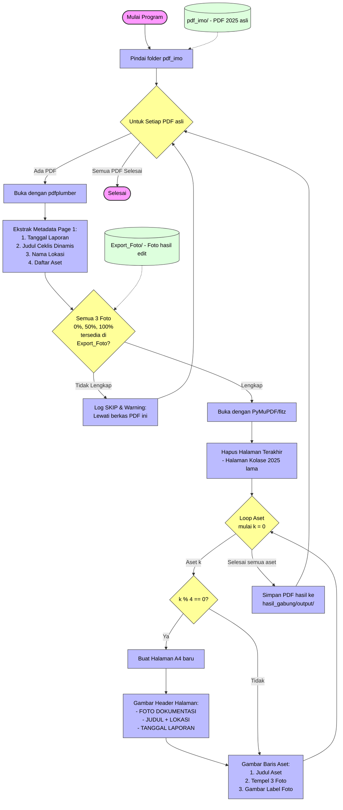

# 🏛️ Arsitektur & Diagram Sistem Kerja `merge_pdf_foto.py`

Dokumen ini menjelaskan alur kerja dan arsitektur pemrosesan dari skrip [merge_pdf_foto.py](file:///c:/Users/dikarm/Documents/Server/OCR-FOTO-P3STE/merge_pdf_foto.py) yang digunakan untuk menggabungkan foto-foto dokumentasi baru (format 2026) ke dalam berkas laporan PDF lama (format 2025).

---

## 📊 Diagram Alur Pemrosesan (Flowchart)

Berikut adalah diagram alur logis yang menunjukkan bagaimana skrip memilah dokumen, mengekstrak data, melakukan validasi, dan membangun halaman dokumentasi baru:

---

## 🛠️ Komponen Utama Sistem Kerja

### 1. **Parser & Detektor Dinamis (`pdfplumber`)**
Mengambil informasi dari berkas PDF input tanpa berasumsi format tanggal atau judulnya statis:
- **Nama Lokasi**: Diekstrak dari nama berkas PDF (contoh: `..._Cilebut-Bogor (2).pdf` $\rightarrow$ `CILEBUT-BOGOR`).
- **Judul Ceklis**: Dicari baris pada Halaman 1 yang memiliki kata kunci `"PERAWATAN"` (contoh: `PERAWATAN AXLE COUNTER SIEMENS 1 BULANAN` atau `PERAWATAN WESEL ELEKTRIK 2 MINGGUAN`).
- **Tanggal Laporan**: Dicari dari kolom `Tanggal : YYYY-MM-DD` dan diterjemahkan ke format Indonesia.
- **Identifikasi Aset**: Mencari baris kode aset seperti `AXL11468` dan detail namanya (`ZP 60 BOO`) dengan mengabaikan baris komparasi/palsu di bagian bawah halaman.

### 2. **Pencocokan & Proteksi Foto (Option B)**
Skrip menuntut kelengkapan mutlak berkas gambar sebelum mengubah PDF:
- Menghubungkan nama detail aset dengan direktori penyimpanan foto hasil edit: `output_pdf_foto/Export_Foto/[ASSET_TYPE]/[DETAIL_ASSET]/`.
- Skrip memverifikasi keberadaan berkas `0.jpg`, `50.jpg`, dan `100.jpg`.
- **Jika ada satu saja aset yang kekurangan foto**, pemrosesan berkas PDF tersebut langsung dihentikan secara aman untuk menghindari hilangnya data dokumentasi, lalu skrip melompat ke berkas PDF berikutnya.

### 3. **Penyusun Layout PDF (`fitz` / PyMuPDF)**
Merekondisi halaman PDF secara langsung tanpa *rendering* gambar yang menurunkan kualitas:
- **Penghapusan Kolase Lama**: `doc.delete_page(-1)` memotong halaman terakhir PDF yang berisi kolase foto format 2025.
- **Pembuatan Halaman Baru**: Menghasilkan halaman A4 kosong (`595 x 842` pt).
- **Penataan Grid Baris & Kolom**:
  - Judul aset ditaruh di sisi kiri atas setiap baris.
  - Gambar ditempel secara horizontal di X = `31.5`, `210.4`, dan `389.8` dengan ukuran `148.8 x 148.8` pt.
  - Skrip menghitung secara dinamis titik tengah kolom gambar untuk menempatkan label `Foto 0%`, `Foto 50%`, dan `Foto 100%` agar simetris di bawah foto.
  - Skrip mengalirkan baris aset secara dinamis (maksimal 4 aset per halaman). Jika terdapat 5 aset, skrip otomatis membuat 2 halaman dokumentasi foto baru.
